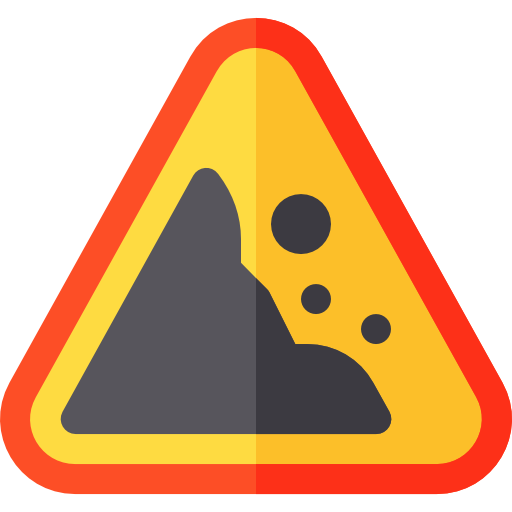

<a href="icon.png"></a> ErosionFinder CLI
==================================


A command line interface to use ErosionFinder library to find architectural erosion across C# code.

The code of the ErosionFinder library is available [here](https://github.com/rafaatsouza/erosion-finder).

Example
------------
The following command:
```sh
./ErosionFinderCLI -s {Path to .sln file} -l {Path to constraints.json file} -o {Output file path}
```

Will generate an HTML output file with all retrieved architectural erosions.

<sub>*Icon made by [Freepik](https://www.flaticon.com/authors/freepik) from https://www.flaticon.com*</sub>
